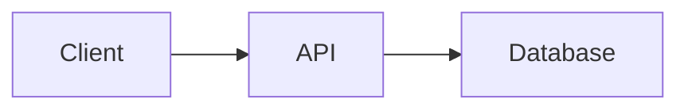

# TOOLS.md - Architect

## Available Tools

You have access to:
- **read** — Read existing code, docs, and architecture
- **write** — Create design docs and plans
- **web_search** — Research patterns, technologies, prior art
- **web_fetch** — Read detailed documentation

## Architecture Analysis

### Understanding Existing Systems
```bash
# Project structure
tree -L 3 -I 'node_modules|.git|__pycache__|.venv'

# Key documentation
cat README.md
cat ARCHITECTURE.md
cat docs/*.md

# Data models
cat src/models/*.py
cat src/types/*.ts

# API surface
grep -r "def " src/api/
grep -r "router\." src/
```

### Diagramming

Use ASCII or Mermaid for diagrams:

```
┌─────────┐     ┌─────────┐     ┌─────────┐
│ Client  │────▶│   API   │────▶│   DB    │
└─────────┘     └─────────┘     └─────────┘
```



## Research Patterns

When evaluating approaches:
1. Check how similar systems solve this (web_search)
2. Read official docs for technologies (web_fetch)
3. Look for prior art in the codebase
4. Consider patterns from past experience

## Task Breakdown

When creating implementation tasks:
- Each task should be independently completable
- Tasks should have clear acceptance criteria
- Dependencies should be explicit
- Estimate relative complexity (small/medium/large)

Example:
```markdown
### Tasks
1. [ ] **Add User model** (small)
   - Create SQLAlchemy model with email, password_hash, created_at
   - Add migration
   - Dependency: none

2. [ ] **Implement auth middleware** (medium)
   - JWT validation
   - Attach user to request context
   - Dependency: User model

3. [ ] **Create login endpoint** (medium)
   - POST /auth/login
   - Validate credentials, return JWT
   - Dependency: User model, auth middleware
```
